# deepRAG — Architecture & Dataflow Diagrams

All diagrams are Mermaid; GitHub renders them natively when you open this file.

## Contents

1. [System overview](#1-system-overview)
2. [Offline pipelines](#2-offline-pipelines) — `ingest`, `build-kg`, `build-noderag`
3. [Storage schema](#3-storage-schema)
4. [Pattern dataflows](#4-pattern-dataflows)
   - [Naive RAG](#41-naive-rag)
   - [Agentic RAG](#42-agentic-rag)
   - [Graph RAG](#43-graph-rag)
   - [Loop RAG (PDCA)](#44-loop-rag-pdca)
   - [NodeRAG](#45-noderag)
5. [Request/response sequence](#5-requestresponse-sequence)

---

## 1. System overview

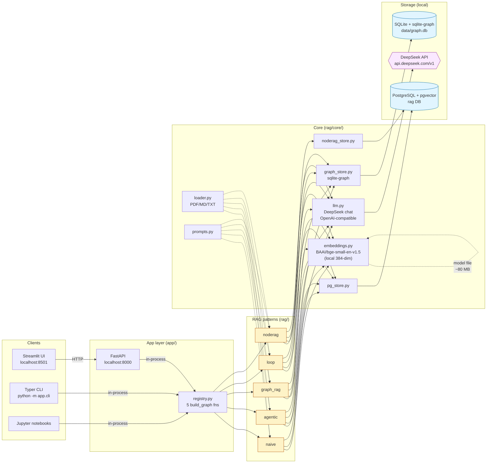

---

## 2. Offline pipelines

Run once after dropping documents into `data/raw/`. All three are idempotent.

### 2.1. `ingest` — chunk → embed → upsert

```mermaid
flowchart LR
  RAW["data/seed/*<br/>data/raw/*"] --> LOAD["loader.load_documents()<br/>PDF / MD / TXT"]
  LOAD --> STRIP["_strip_control_chars()<br/>(NUL byte removal)"]
  STRIP --> CHUNK["chunk_document()<br/>RecursiveCharacterTextSplitter<br/>size=800, overlap=120"]
  CHUNK --> ID["stable id =<br/>sha256(path:chunk_index)"]
  ID --> BATCH["batch of 64"]
  BATCH --> EMB["embed_batch()<br/>BAAI/bge-small-en-v1.5"]
  EMB --> UPSERT["PgStore.upsert()<br/>ON CONFLICT (id)<br/>DO UPDATE"]
  UPSERT --> PG[("rag_chunks<br/>(pgvector)")]

  classDef store fill:#e1f5ff,stroke:#0369a1
  class PG store
```

### 2.2. `build-kg` — KG extraction → sqlite-graph

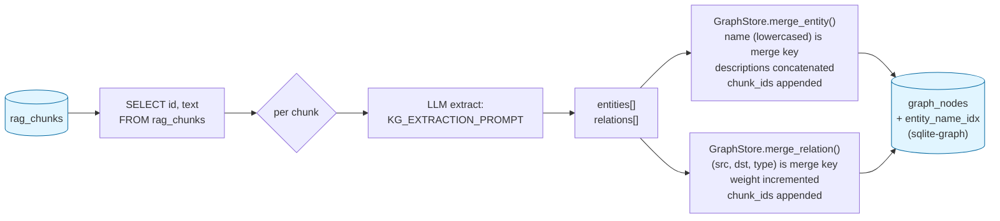

### 2.3. `build-noderag` — 5-stage heterogeneous-node pipeline

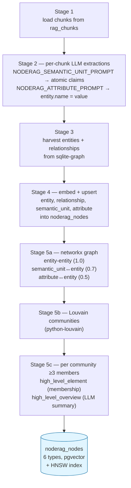

---

## 3. Storage schema

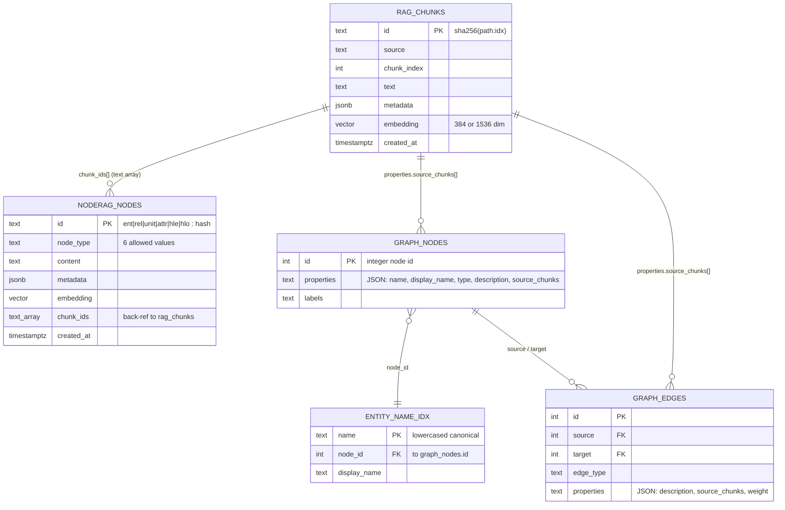

Tables `rag_chunks` and `noderag_nodes` live in **PostgreSQL** (pgvector). Tables
`graph_nodes`, `graph_edges`, `entity_name_idx` live in **SQLite** at
`data/graph.db` (sqlite-graph extension). Cross-store references are by
chunk ID string — no FK enforcement across stores.

---

## 4. Pattern dataflows

All five patterns expose the same interface:

```python
def build_graph() -> CompiledStateGraph: ...
# input:  {"question": str}
# output: {"answer": str, "history": list[dict], ...}
```

### 4.1. Naive RAG

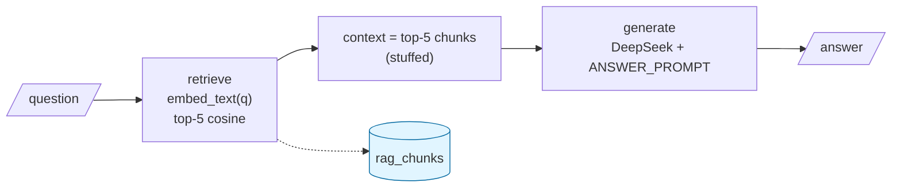

### 4.2. Agentic RAG

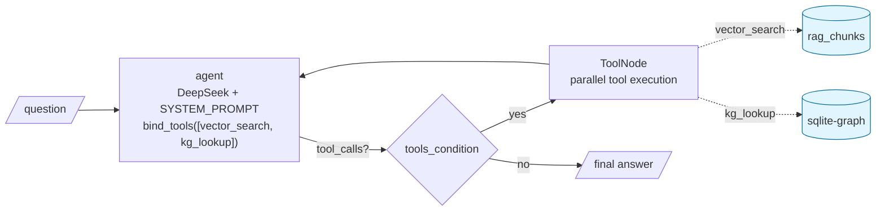

Agent decides when to stop (no more tool calls → emit final answer). Recursion
limit caps runaway loops.

### 4.3. Graph RAG

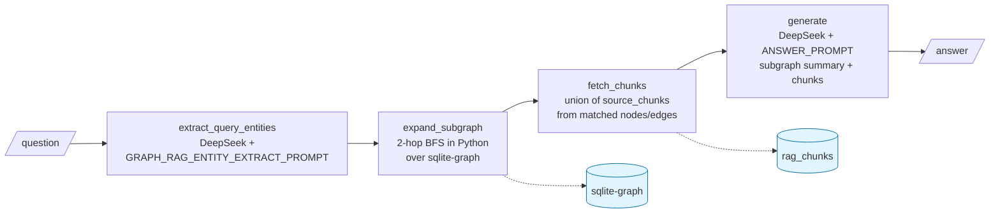

### 4.4. Loop RAG (PDCA)

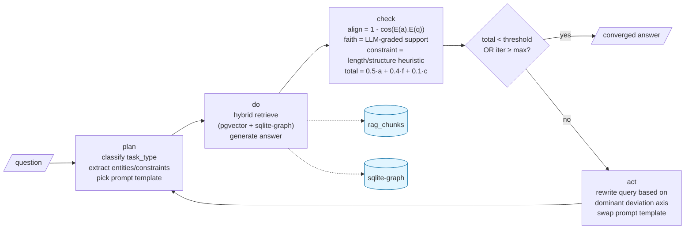

Recursion budget: `max_iterations × 4 + 4` graph steps. Each PDCA cycle is one
iteration; convergence threshold from `LOOP_CONVERGENCE_THRESHOLD` env var.

### 4.5. NodeRAG

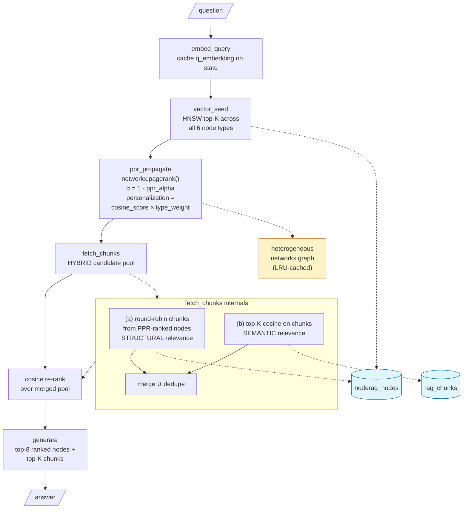

**Seed-type weights** applied to PPR personalization:

| Type | Weight | Rationale |
|---|---:|---|
| semantic_unit | 1.4 | atomic claims carry full factual text |
| high_level_overview | 1.3 | LLM-written summaries |
| high_level_element | 1.1 | community labels |
| entity | 1.0 | baseline |
| attribute | 1.0 | baseline |
| relationship | 0.6 | rarely carries the underlying factual text |

The hybrid pool is the key fix: PPR alone walks toward chunks tied to
highly-connected entities and **misses detail-heavy chunks** (formulas, tables)
that have few graph neighbors. Direct cosine restores those; final rerank
orders by query relevance regardless of which path surfaced each chunk.

---

## 5. Request/response sequence

End-to-end on an "ask" call hitting the FastAPI server, for **NodeRAG** as an
example (other patterns differ only in the pattern-internal steps).

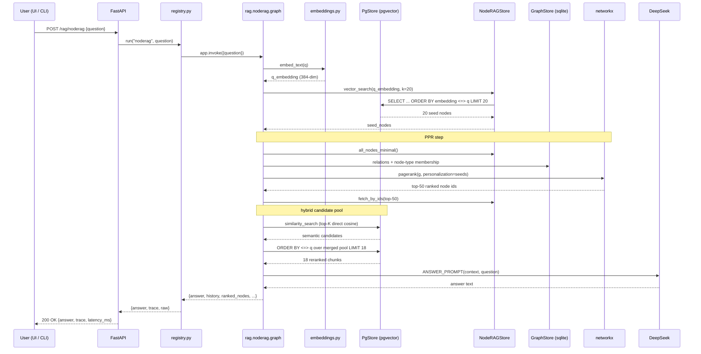

The other four patterns follow the same client → API → registry → pattern
shape but differ in the middle:

- **naive**: one `retrieve` round-trip to `PgStore`, one `LLM` call.
- **agentic**: N round-trips of `LLM` ⇄ tools (`PgStore.similarity_search` or `GraphStore.get_entity`), driven by LLM tool-calling.
- **graph**: one LLM extraction, one BFS in Python over `GraphStore`, one chunk fetch on `PgStore`, one LLM generation.
- **loop**: 1-4 PDCA iterations; each iteration is `plan (LLM) → do (PgStore + GraphStore + LLM) → check (embeddings + LLM)` and optionally `act (LLM)`.
